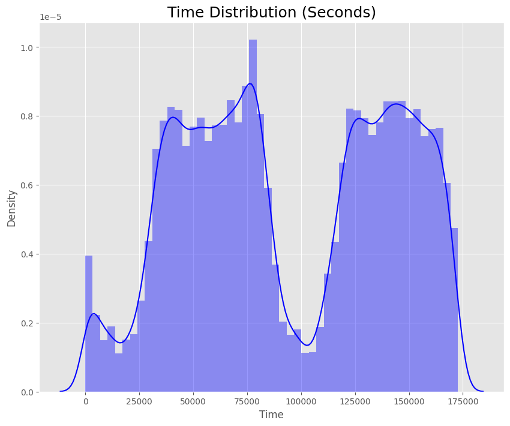
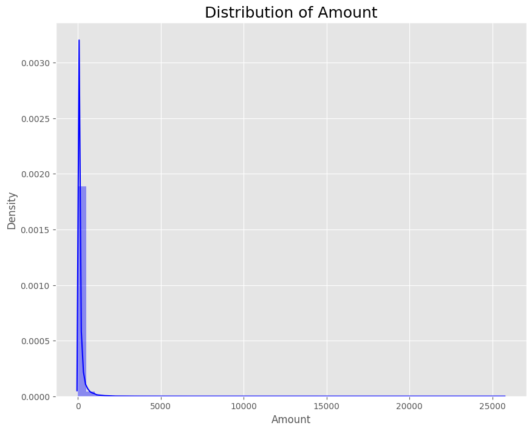
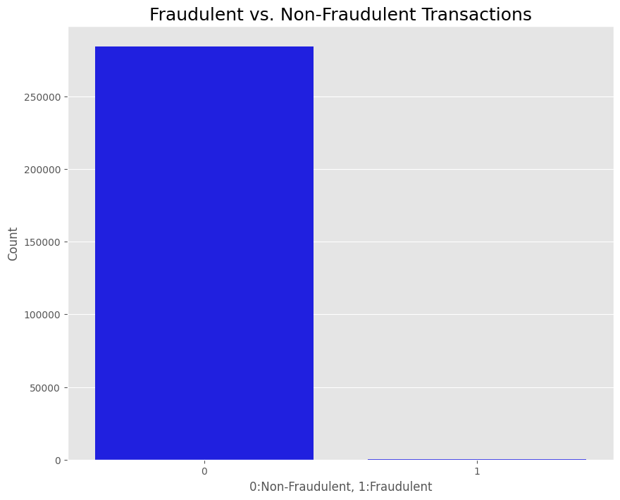
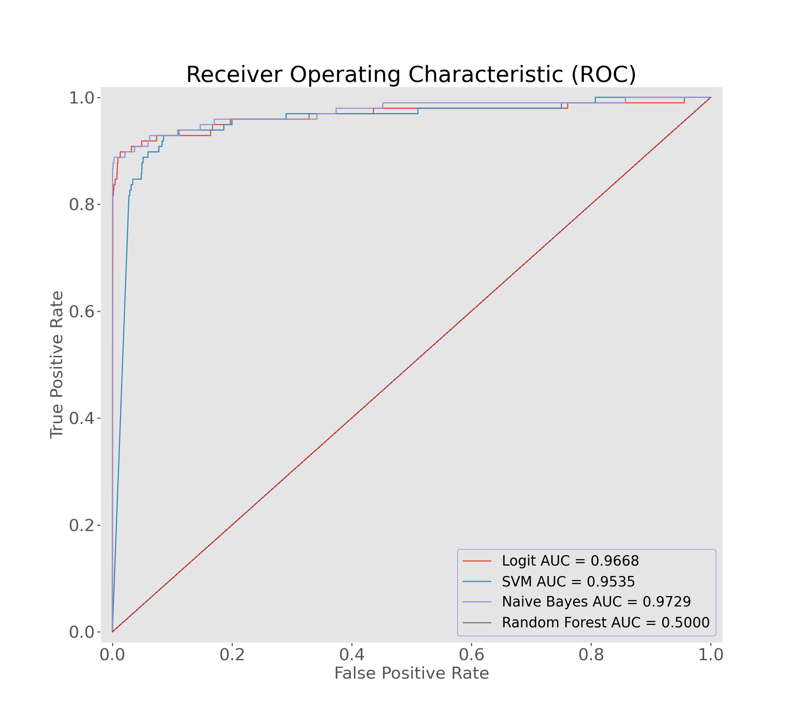
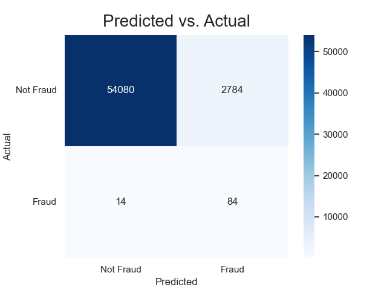

# Credit Card Fraud Detection

Losses related to credit card fraud will grow to $43 billion within five years and climb to $408.5 billion globally within the next decade, according to a recent Nilson Report — meaning that credit card fraud detection has become more important than ever. Credit card fraud is the act of using another person’s credit card to make purchases or request cash advances without the cardholder’s knowledge or consent. 

In recent years, as the amount of data has exploded and the number of payment card transactions has skyrocketed, credit fraud detection has become largely digitized and automated. Most modern solutions leverage artificial intelligence (AI) and machine learning (ML) to manage data analysis, predictive modeling, decision-making, fraud alerts and remediation activity that occur when individual instances of credit card fraud are detected by using methods like:
- Anomaly detection
- Outlier detection
- Supervised machine learning or Predictive modeling

## Dataset

In this project, we will use a dataset containing transactions made by credit cards in September 2013 by european cardholders. This dataset presents transactions that occurred in two days, where we have 492 frauds out of 284,807 transactions. The dataset is highly unbalanced, the positive class (frauds) account for 0.172% of all transactions.

The dataset can be downloaded from [Kaggle](https://www.kaggle.com/mlg-ulb/creditcardfraud).

## EDA

Some exploratory data analysis was performed to understand the data. The following plots show the underlying distributions of the data.

- From the figure above, it can be observed that the `Time` feature has a bimodal distribution with two peaks, indicating that there are two periods during the day when credit card transactions are more frequent. 
- The first peak occurs at around 50,000 seconds (approximately 14 hours), while the second peak occurs at around 120,000 seconds (approximately 33 hours). This suggests that there may be a pattern in the timing of credit card transactions that could be useful for fraud detection.

- From the figure above, it can be observed that the `Amount` feature is highly skewed to the right, with a long tail to the right. This indicates that the majority of the transactions have low amounts, while a few transactions have extremely high amounts. 
- As a result, this suggests that the dataset contains some outliers in terms of transaction amounts. Therefore, when building a model for fraud detection, it may be necessary to handle outliers in the Amount feature, for instance, by using a log transformation or robust statistical methods.

- From the figure above, it can be observe that the dataset is highly imbalanced, with a vast majority of transactions being non-fraudulent (class 0) and a relatively small number of transactions being fraudulent (class 1). This indicates that the dataset has a class imbalance problem, which may affect the performance of a model trained on this dataset.
---
## Model Building

- The "Credit Card Fraud Detection" dataset has credit card transactions labeled as fraudulent or not. The dataset is imbalanced, so it needs a model that can accurately detect fraudulent transactions without wrongly flagging non-fraudulent transactions. To help with classification problems, **StandardScaler** standardizes data by giving it a mean of 0 and a standard deviation of 1, which results in a normal distribution. This technique works well when dealing with a wide range of amounts and time. To scale the data, the training set is used to initialize the fit, and the train, validation, and test sets are then scaled before running them into the models.

- The dataset is divided into 60% for training, 20% for validation, and 20% for testing. To balance the imbalanced dataset, **Random Undersampling** was used to match the number of fraudulent transactions. Logistic Regression and Random Forest models were used, and good results were produced. 

- The commonly used models for the "Credit Card Fraud Detection" dataset are Logistic Regression, Naive Bayes, Random Forest, and Dummy Classifier which is a simple algorithm used as a benchmark to compare the performance of other models.

---
## Model Evaluation

The commonly used models for the “Credit Card Fraud Detection” dataset are Logistic Regression, Naive Bayes, Random Forest, and Dummy Classifier and their ROC ciurves are shown below:

- From the figure above, it can be observed that the Naive Beyes model has the highest AUC score of 0.97, followed by the Logistic Regression model with an AUC score of 0.96.

Confusion matrix for the first 2 models namely Naive Bayes and Logistic Regression are shown below respectively:

---